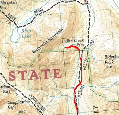

I hate this trail! I'm sure there are people who will disagree with me but I don't care. The three times I've done it have been absolutely miserable. I won't even use it to get to Ship Lake Valley which is one of my all time favorite places to be in the Chugach.

Why do I hate this trail? Let me count the ways:

**The trail to the Pass is gross:** The one part of the hike with a clearly marked trail is underneath canopy. There are parts of it with this gross smelling marsh stuff and half of the trail is usually muddy. The last 1/2 mile is ok for the nice view of Turnagain Arm. 

**The [post holing](../education/#post-holing):** I'd be lot more mellower about this but it's never ending once you get to the pass. Because the area is covered by an abundance of low shrub, you'll never know if that next step is going to have you sinking up to your thighs.

**The [bushwhacking](../education/#bushwhacking):** When the snow finally melts, the brush grows pretty high. 1 mile can take forever as you wind your way through willow and shrub hoping you don't fall down because you didn't see that hole. Once, I made it 3 miles in and I finally got to a hill and when I saw miles more of it, I turned back and said the hell with it. Someday, a trail will be blazed and this will be a great hike. For now, it's just a pain in the A**.

**No decent campsites:** After spending hours bushwhacking, it took me a half and hour just to find a halfway decent place that was level and not crowded with brush. 

The only good thing about the area is that there is some beautiful scenery but there's plenty of other places that look just as good without all the trouble.

*The following was added on August 23, 2009:*

So, I decided to go back this weekend, with the attention of either turning into Ship Lake or the valley of tarns that lies below Bird Ridge. This was the first time hiked this trail in late summer. Boy! Does this trail get overgrown. I made sure to make a lot of noise due to the numerous sightings of bear scat.

My verdict is still the same. This just isn't a pleasant trail to be on. 

However, it is worth putting up with to get to glacial valleys that join it, including Ship Lake, Bird Ridge, North Fork Ship Lake (Grizzly Bear Lake), and other un-named cirques.

*Hidden Tarn Option (for experienced backpackers/hikers only) added July 2020*

It's been over 10 years since I've been on this trail (still not a big fan) and my plan was to hook left into Ship Lake when I got to the Pass, but I undershot it and started heading to the small hanging valley just south of it. I realized my mistake in time to fix it but since I was already halfway in and tired, I decided to just head up it and camp there.

So glad I did! While a small area, the view is beautiful with a nice little tarn being fed by a long cascading waterfall coming from the cirque above. The valley has a lot of hillocks so you'll need to spend a bit of energy finding a flat enough area putting up your tent but there are places. If you're looking for total privacy, you can't do better.

If you are a newbie, I would not recommend this as there is no clear route to get to the tarn. There are lots of dense spruce areas, steep hills and other barriers that you must carefully maneuver around. The only advice I can give you would be to stay on the southern side as that seems to have the least obstacles; that is how I came in. I thought it was a good idea to leave on the north side and that was a mistake because I wound up having to bushwhack through a spruce forest and then a tangle of willow before getting back on the Indian Valley Trail proper.

### Important Information

Make sure you [filter your water](../education/#water-filter). There are a large amount of beaver dams along the creek. Be [avalanche aware](../education/#avalanche) during snow season.

If you're using this trail to get to Ship Lake, beeline toward the ridge of Ship Lake Valley and at least you'll avoid a lot bushwhacking there too.

### Etc.

The best way to hike this in the winter is to buy a cheap plastic sled and carry your stuff on it. For details about how I built mine, go [here](../education/how-to-build-a-sled-for-winter-hiking/ "How to Build a Sled for Winter Hiking").
