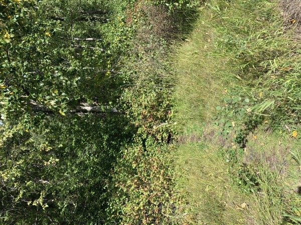
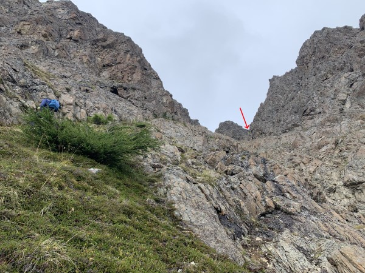

This is a very steep climb, not for the faint of heart! But the payoff is some fabulous views of Turnagain Arm, and definitely well worth the effort! When I hiked it, it took me 3 hours to climb the 3 miles to the summit.

The trailhead is at about mile 104.5 of the Seward Highway, just before you get to the town of Indian. There is a small pullout, room for only 3-4 cars. The trailhead is on the far right side of the pullout, and easy to miss unless you're looking right at it.

For about the first 0.4 miles, the trail travels through a heavily wooded area and isn't very steep. Shortly after emerging from the woods, there is a sharp switchback to the right that's easy to miss, because the trail you're on keeps going straight. From there, the trail gets quite steep, and you start gaining elevation quickly.

Of course this photo doesn't do it justice, but gives you a good idea of just how quickly the trail rises up from the highway.

Once you reach the top of the first steep section, the trail leads to the left along a lower ridge. You do not want to follow this all the way to the upper ridge, as the upper ridge is very rocky and difficult to travel.

About midway up the lower ridge, you'll see what looks like a faint game trail leading off to the right. You'll want to follow that trail, which will require a bit of side-hilling, so watch your footing on this section, especially if it's wet.

After crossing a small ridge, you'll see a rocky gully above you that will lead to the summit. Be especially careful in this section, as the gully is full of scree and talus. You're aiming for the notch to the right at the top of the gully.

After passing through that notch, the summit is not much farther. Depending on the weather, the summit offers fantastic views of the Turnagain Arm and surrounding mountains. Take some time to enjoy the views before starting your descent.

### Important Information

I've read that it's also possible to reach the summit from the backside, coming from the [Falls Creek Trail](./falls-creek-trail), but I have not attempted that route myself.

There are no sources of water on this hike, so come prepared.
